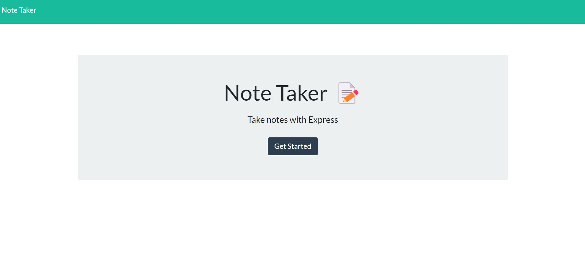
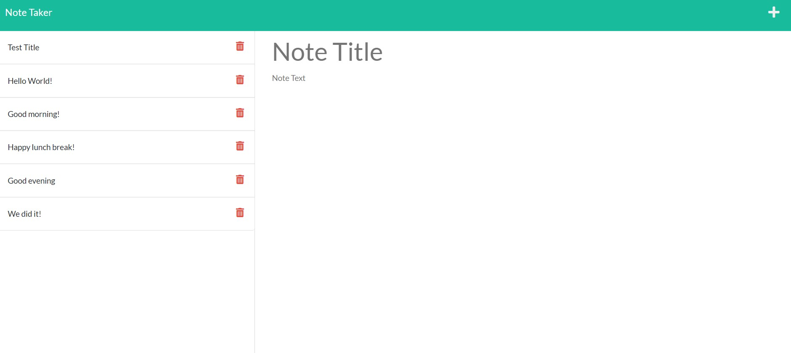

# Julian-Franklin-Express.js-Note-Taker

  

  ## Description
  
  This application is created to allow user to create and delete notes. Users can enter the appication by clicking on the Get Started button. On the notes page, users can type notes titles and descriptions and save them using the save button in the top right corner. Their note will generate on the left with a delete button. Users can then click the delete button to remove it from the notes.

  [Link to deployed website](https://arcane-gorge-17984.herokuapp.com/)

  

  

  ## Table of Content
  - [Installation](#installation)
  - [Usage](#usage)
  - [Contributing](#contributing)
  - [Tests](#tests)
  - [Questions](#questions)
  - [License](#license)

  ## Installation

  To install, run ```npm i``` in the command line.

  ## Usage

  Feel free to use this application.

  ## Contributing

  At this time, the project is not accepting contributions.

  ## Tests
  
  You will not need to run tests for this application.

  ## Questions

  If you have any questions, contact me at j.franks725@gmail.com. Visit my GitHub page at [jfranklin12](https://github.com/jfranklin12/) to see my other projects.

  ## Liscence
    
This projected is licensed under MIT.

  https://opensource.org/licenses/MIT